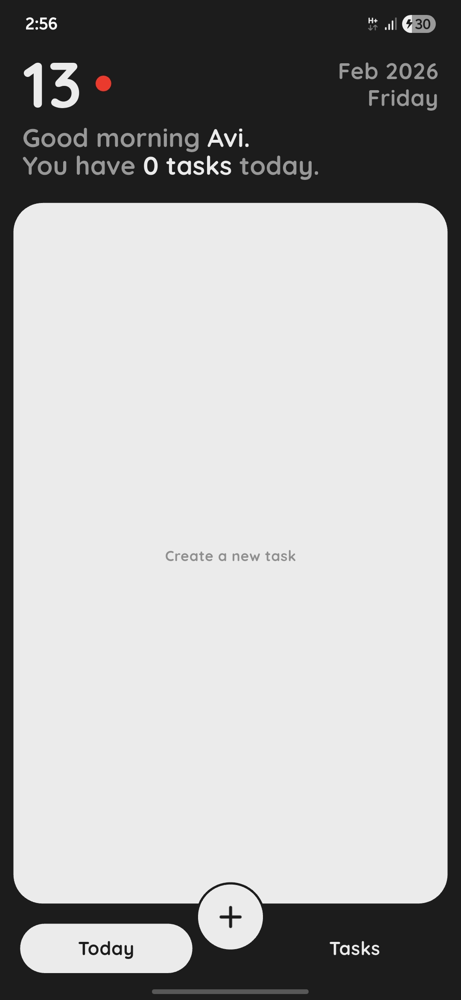
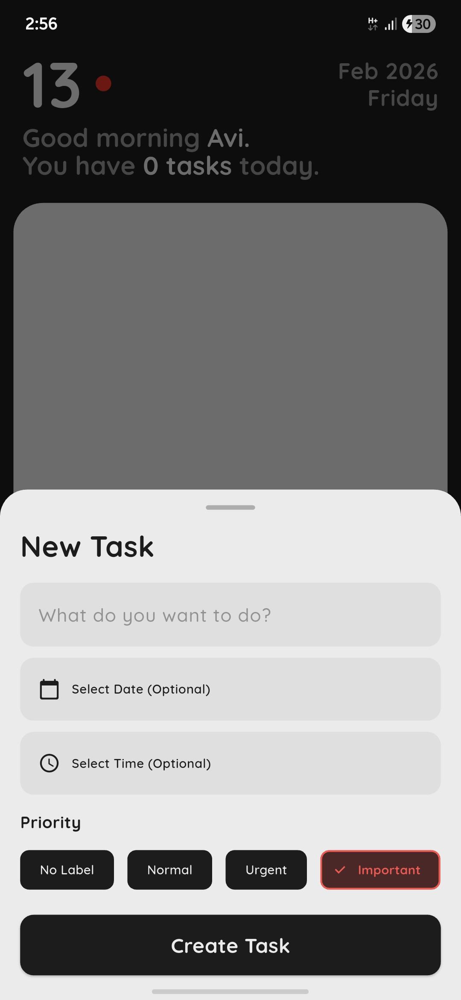
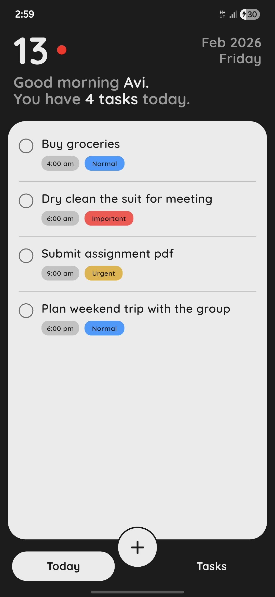
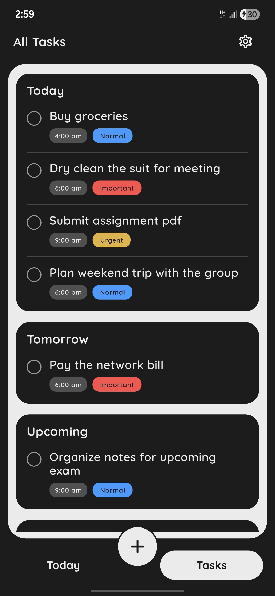
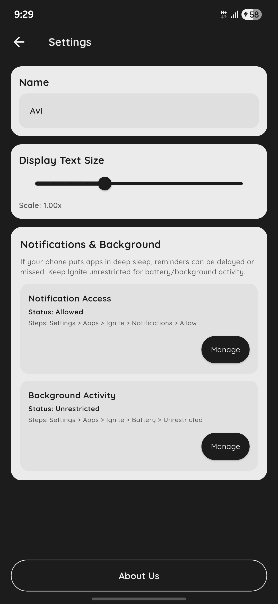

  <h1>Ignite</h1>

  

    <b>A minimal offline to-do app built for clarity, speed, and daily execution.</b> 
    No accounts. No cloud. Just you and your tasks.
  

   

  
  
  
  

   
   

  

    <b>Status:</b> Released (v1.2.1)
     
    <b>Download:</b>
    <a href="https://github.com/Abhinav08bhatt/Ignite/releases/latest" target="_blank"
      style="display: inline-block; padding: 8px 14px; background: #58CC02; color: white;
      text-decoration: none; font-weight: bold; border-radius: 10px;">
      Download Latest APK
    </a>
  

 

  
  
  
  
  

<h2>What is Ignite?</h2>

Ignite is a lightweight task manager designed to stay out of your way.
It’s built for people who want a clean UI, quick task creation, and reliable reminders
without logging in or syncing to the cloud.

Everything stays on your device. No tracking. No distractions.

<h2>Key Features</h2>

<ul>
  <li>Create tasks with optional date and time</li>
  <li>Priority labels: Normal / Urgent / Important</li>
  <li>Smart grouping: Today / Tomorrow / Upcoming / Someday</li>
  <li>Mark tasks as completed (completed tasks move down automatically)</li>
  <li>Swipe-to-delete with confirmation (safe deletion)</li>
  <li>Scheduled local notifications for timed tasks</li>
  <li>Personal greeting with editable username</li>
  <li>Font scaling slider (text size control)</li>
  <li>Fully offline (no internet required)</li>
</ul>

<h2>Notifications</h2>

Ignite supports scheduled local notifications for tasks with date + time.
Reminders work even when the app is closed.

Completed tasks and tasks without a time are ignored by the notification system.

<h2>Why Ignite?</h2>

A lot of productivity apps feel like dashboards. Too many buttons, too many menus,
too many systems to learn.

Ignite is built to feel simple and calm — like a daily companion that helps you stay on track.

<h2>Design Direction</h2>

Ignite follows a clean dark theme with high contrast UI and smooth card-based sections.
Priority labels are color-coded for quick recognition.

<ul>
  <li><b>Primary:</b> <code>#1C1C1C</code></li>
  <li><b>Background:</b> <code>#EBEBEB</code></li>
  <li><b>Accent Red:</b> <code>#FF1919</code></li>
  <li><b>Normal:</b> Blue</li>
  <li><b>Urgent:</b> Yellow</li>
  <li><b>Important:</b> Red</li>
</ul>

<h2>Download</h2>

Ignite is not published on the Play Store yet.
For now, all APK builds are uploaded through <b>GitHub Releases</b>.

 

  <a href="https://github.com/Abhinav08bhatt/Ignite/releases/latest" target="_blank"
     style="display: inline-block; padding: 12px 22px; background: #58CC02; color: white;
            text-decoration: none; font-weight: bold; border-radius: 12px;">
    Download Latest APK
  </a>

 

<ul>
  <li>Download the APK from the Releases page</li>
  <li>Install it on your Android device</li>
  <li>If Android blocks installation, enable <b>"Install unknown apps"</b> for your browser/file manager</li>
</ul>

<h2>Tech Stack</h2>

<ul>
  <li><b>Flutter</b></li>
  <li><b>Hive</b> (local database)</li>
  <li><b>Provider</b> (state management)</li>
  <li><b>flutter_local_notifications</b> (scheduled reminders)</li>
  <li><b>timezone</b> (accurate scheduling)</li>
</ul>

<h2>Roadmap</h2>

  
<b>Version 1.x (Current Stage)</b>

   
  <ul>
    <li>More UI polish</li>
    <li>Improved animations</li>
    <li>Better task editing flow</li>
    <li>More settings options</li>
    <li>Bug fixes and performance improvements</li>
  </ul>

 

  
<b>Version 2.0</b>

   
  

    Version 2.0 will expand Ignite into a complete daily routine partner.
  

  <ul>
    <li>Home</li>
    <li>Tasks</li>
    <li>Focus</li>
    <li>Profile</li>
  </ul>

<h2>Privacy</h2>

Ignite does not collect user data.
All tasks and settings are stored locally on your device using Hive.

No account system. No analytics. No cloud sync.

<h2>Support</h2>

If you use Ignite and find it helpful:

<ul>
  <li>Star the repo</li>
  <li>Report bugs in Issues</li>
  <li>Suggest improvements</li>
</ul>

Built by <a href="https://github.com/Abhinav08bhatt" target="_blank"><b>Avi</b></a>.

<h2>License</h2>

<b>Proprietary License (All Rights Reserved).</b> 
This project is not open-source. APK builds are provided for personal use only.

  <h3>Ignite your day. Finish what matters.</h3>

