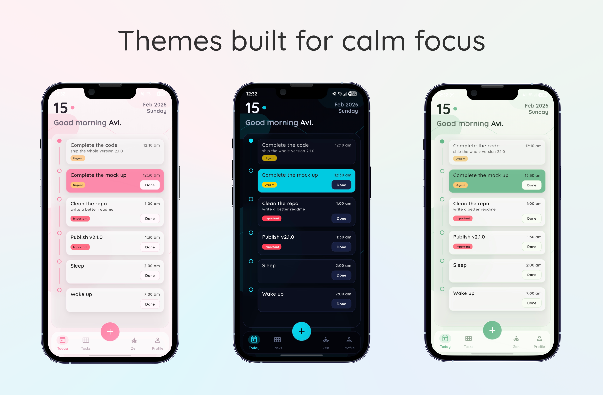

  <h1>Ignite</h1>

  

    <b>A calm, offline daily planner for tasks, mood check-ins, and journaling.</b> 
    No account. No cloud. Just your day, on your device.
  

   

  
  
  
  

   
   

  

    <b>Status:</b> Active Development (v2.1.0)
     
    <b>Download:</b>
    <a href="https://github.com/Abhinav08bhatt/Ignite/releases/latest" target="_blank"
      style="display: inline-block; padding: 8px 14px; background: #58CC02; color: white;
      text-decoration: none; font-weight: bold; border-radius: 10px;">
      Download Latest APK
    </a>
  

 

  
  

<h2>What is Ignite?</h2>

Ignite is a lightweight, offline-first app built to help you execute your day without noise.
It combines practical task management with emotional self-check and daily journaling in one calm interface.

Everything is stored locally on your device. No sync, no tracking, no account required.

<h2>What’s New In This Version</h2>

<ul>
  <li>Complete Profile page redesign with a calmer card-based layout</li>
  <li>Daily Mood Board with 5 independent sliders (Calm, Happy, Sad, Anxious, Anger)</li>
  <li>Dominant-mood insight text that updates based on slider values</li>
  <li>Daily Journal flow with <b>one journal per day</b></li>
  <li>"Create a new journal" / "Edit the journal" smart action based on today’s entry</li>
  <li>Journal editor page with date header and saved daily emotion mix indicator</li>
  <li>Recent Journals section focused on previous days (yesterday and earlier)</li>
  <li>Theme-aware background and card surfaces across the new profile/journal experience</li>
</ul>

<h2>Core Features</h2>

<ul>
  <li>Create tasks with optional date and time</li>
  <li>Priority labels: Normal / Urgent / Important</li>
  <li>Smart grouping: Today / Tomorrow / Upcoming / Someday</li>
  <li>Today timeline sorting by schedule flow</li>
  <li>Swipe actions for done/undone/delete with safety confirmation</li>
  <li>Scheduled local notifications for timed tasks</li>
  <li>User name personalization and text scaling controls</li>
  <li>Theme system with system/light/dark variants</li>
  <li>Fully offline local persistence using Hive</li>
</ul>

<h2>Mood + Journal Model</h2>

Ignite now stores daily reflection state per date:

<ul>
  <li>5 mood percentages (0–100%) for each day</li>
  <li>Journal text for that day</li>
  <li>Single-entry-per-day journal rule</li>
</ul>

This gives your profile page historical emotional context alongside journal history.

<h2>Notifications</h2>

Ignite supports scheduled local reminders for tasks with date + time.
Reminders can work even when the app is closed.

Completed tasks and tasks without time are excluded from timed reminder scheduling.

<h2>Download</h2>

Ignite is currently distributed via <b>GitHub Releases</b>.

 

  <a href="https://github.com/Abhinav08bhatt/Ignite/releases/latest" target="_blank"
     style="display: inline-block; padding: 12px 22px; background: #58CC02; color: white;
            text-decoration: none; font-weight: bold; border-radius: 12px;">
    Download Latest APK
  </a>

 

<ul>
  <li>Download the APK from Releases</li>
  <li>Install it on Android</li>
  <li>If blocked, enable <b>Install unknown apps</b> for your browser/file manager</li>
</ul>

<h2>Tech Stack</h2>

<ul>
  <li><b>Flutter</b></li>
  <li><b>Hive</b> (local database)</li>
  <li><b>Provider</b> (state management)</li>
  <li><b>flutter_local_notifications</b> (scheduled reminders)</li>
  <li><b>timezone</b> (accurate scheduling)</li>
  <li><b>url_launcher</b> (external links)</li>
</ul>

<h2>Roadmap</h2>

  
<b>Current Focus (v2 cycle)</b>

   
  <ul>
    <li>Journal page refinements and richer emotional insights</li>
    <li>Profile analytics polish and historical trends</li>
    <li>More UX smoothness and visual micro-interactions</li>
    <li>Reliability and performance improvements</li>
  </ul>

 

  
<b>Future Direction</b>

   
  <ul>
    <li>Zen tab expansion</li>
    <li>Broader daily routine support</li>
    <li>Advanced reflection tools (still local-first)</li>
  </ul>

<h2>Privacy</h2>

Ignite does not collect personal data.
Tasks, mood values, journals, and settings are stored locally on your device.

No account. No analytics SDK. No cloud dependency.

<h2>Support</h2>

<ul>
  <li>Star the repo</li>
  <li>Report bugs via Issues</li>
  <li>Share feature requests and UX feedback</li>
</ul>

Built by <a href="https://github.com/Abhinav08bhatt" target="_blank"><b>Avi</b></a>.

<h2>License</h2>

<b>Proprietary License (All Rights Reserved).</b> 
This project is not open-source. APK builds are shared for personal use.

  <h3>Ignite your day. Reflect with intent. Finish what matters.</h3>

