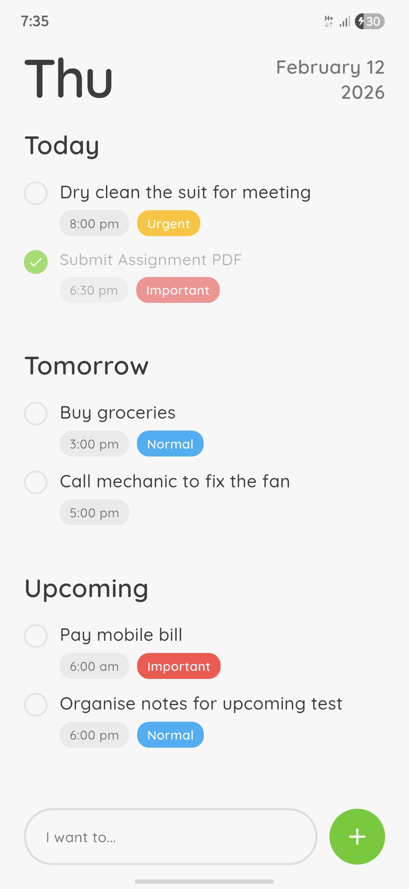

  <h1>Ignite</h1>

  

    <b>A simple offline to-do app for people who just want to get things done.</b> 
    No accounts. No internet. No unnecessary features.
  

   

  
  
  
  

    

  

    <b>Status:</b> In development (v1.0) 
    <b>Download:</b> APK builds will be uploaded in <b>GitHub Releases</b>
  

 

  
  
  

<h2>What is Ignite?</h2>

Ignite is a lightweight to-do app built with one goal:
<b>make task planning feel clean, fast, and stress-free.</b>

Most apps either try to do too much or force you into their productivity system.
Ignite stays simple. You add tasks, assign time if needed, and move on.

<h2>Features (v1.0)</h2>

<ul>
  <li>Create tasks</li>
  <li>Optional date & time</li>
  <li>Priority labels (Normal / Urgent / Important)</li>
  <li>Mark tasks as completed</li>
  <li>Delete tasks anytime</li>
  <li>Automatic grouping: Today / Tomorrow / Upcoming / Someday</li>
  <li>Works completely offline</li>
</ul>

<h2>Notifications</h2>

Ignite will support local notifications so you get reminded at the right time, even if the app is closed.
This is one of the main features and will be included before the first stable release.

<h2>Why I’m building this</h2>

This project started because I wanted a to-do app that feels calm and modern,
without ads, accounts, or complicated screens.

Ignite is meant to feel like a small daily companion — not another app that demands attention.

<h2>UI Style</h2>

Ignite follows a clean light theme with friendly colors (inspired by Duolingo-style UI).

<ul>
  <li><b>Primary Green:</b> <code>#58CC02</code></li>
  <li><b>Normal Label:</b> <code>#1CB0F6</code></li>
  <li><b>Urgent Label:</b> <code>#FFC310</code></li>
  <li><b>Important Label:</b> <code>#FF4B4B</code></li>
  <li><b>Background:</b> <code>#F7F7F7</code></li>
</ul>

<h2>Download</h2>

Ignite is not published on Play Store yet.
For now, APK builds will be shared through <b>GitHub Releases</b>.

 

  <a href="https://github.com/Abhinav08bhatt/Ignite/releases" target="_blank"
     style="display: inline-block; padding: 12px 22px; background: #58CC02; color: white;
            text-decoration: none; font-weight: bold; border-radius: 10px;">
    Download Latest APK
  </a>

  (Reminder: update this link after you publish your first release.)

 

<ul>
  <li>Open the <b>Releases</b> section of this repo</li>
  <li>Download the latest APK</li>
  <li>Install it on your Android device</li>
</ul>

<h2>Tech Stack</h2>

<ul>
  <li><b>Flutter</b> (UI + app logic)</li>
  <li><b>Hive</b> (local storage)</li>
  <li><b>Provider</b> (state management)</li>
  <li><b>Local Notifications</b> (planned)</li>
</ul>

<h2>Roadmap</h2>

  
<b>Version 1.0</b>

   
  <ul>
    <li>Complete task creation + task list flow</li>
    <li>Hive integration</li>
    <li>Provider cleanup</li>
    <li>Notifications</li>
    <li>UI polish + animations</li>
    <li>Stable APK release</li>
  </ul>

 

  
<b>Version 1.x (Polish Updates)</b>

   
  <ul>
    <li>Better sorting & filtering</li>
    <li>More task options</li>
    <li>UX improvements</li>
    <li>Performance optimizations</li>
    <li>Bug fixes</li>
  </ul>

 

  
<b>Version 2.0</b>

   
  

    Version 2.0 will turn Ignite into a daily routine partner, not just a to-do list.
  

  <ul>
    <li>Home</li>
    <li>Tasks</li>
    <li>Focus</li>
    <li>Profile</li>
  </ul>

<h2>Privacy</h2>

Ignite does not require login and does not collect personal data.
Everything stays stored locally on your device.

No tracking. No cloud. No account system.

<h2>Support</h2>

If you try Ignite and like it:

<ul>
  <li>Star the repo</li>
  <li>Test the APK and report bugs</li>
  <li>Suggest improvements in Issues</li>
</ul>

Built by <a href="https://github.com/Abhinav08bhatt" target="_blank"><b>Avi</b></a>.

<h2>License</h2>

<b>Proprietary License (All Rights Reserved).</b> 
This project is not open-source. APK builds are provided for personal use only.

  <h3>Ignite your day. Finish what matters.</h3>

